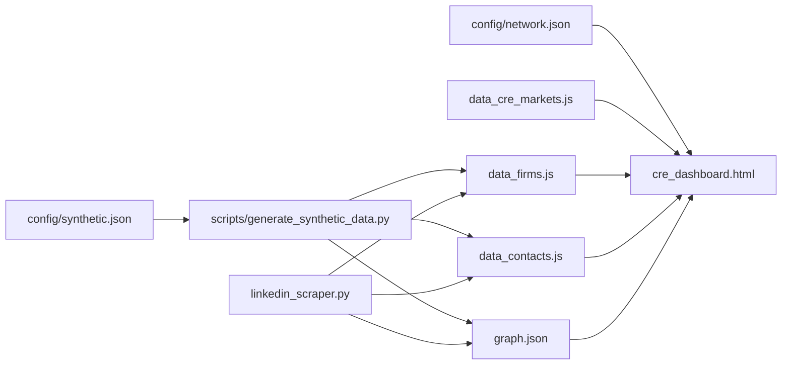

# CRE Career Intelligence Dashboard

A toolkit for job seekers breaking into the Commercial Real Estate (CRE) industry. Scrapes firm websites and LinkedIn to build a database of target companies, contacts, and networking opportunities.

## Live Dashboard

View the interactive dashboard: [CRE Career Intelligence Dashboard](./cre_dashboard.html)

**Features:**
- Interactive map of target markets with distance rings from Columbus
- CRE transaction volume heatmap overlay (toggle view)
- Expandable "network view" for Markets -> Firms -> Contact clusters
- Services matrix showing what each firm offers
- University and professional group connections grouped by market
- Collapsible people view grouped by target firm with enriched vs discovered clusters

## Components

### 1. Website Scraper (`cre_website_scraper.py`)
Extracts firm data from company websites:
- Services offered (Brokerage, Capital Markets, Property Management, etc.)
- Asset specialties (Office, Industrial, Retail, Multifamily, etc.)
- Contact information and leadership names

### 2. LinkedIn Scraper (`linkedin_scraper.py`)
Enriches contact data from LinkedIn profiles:
- Current title and company
- Education history (universities)
- Professional groups and associations
- Work history and career progression
- Colleague discovery

### 3. Pipeline (`cre_pipeline.py`)
Orchestrates the full workflow:
- Scrape websites for all target firms
- Enrich contacts via LinkedIn
- Export to Excel/CSV

### 4. Dashboard (`cre_dashboard.html`)
Static HTML dashboard for GitHub Pages:
- No backend required
- Loads data from JS files
- Interactive filtering and visualization

## Setup

```bash
# Install dependencies
pip install -r scraper_requirements.txt
pip install playwright
python -m playwright install chromium
```

## Usage

### Scrape Firm Websites
```bash
python cre_website_scraper.py
```
Outputs: `scraped_firms.json`, `scraped_firms.csv`, `scraped_firms_leadership.csv`

### Enrich Contacts via LinkedIn

**First time - login and save cookies:**
```bash
python linkedin_scraper.py --login
```
This opens a browser for you to log in manually. Cookies are saved for future runs.

**Enrich one person per company:**
```bash
python linkedin_scraper.py --one-per-company --limit 10
```

**Enrich specific person:**
```bash
python linkedin_scraper.py --search "John Smith" --company "JLL"
```

### View Dashboard
Open `cre_dashboard.html` in a browser, or deploy to GitHub Pages.

## Data Files

| File | Description | Git |
|------|-------------|-----|
| `scraped_firms.json` | Firm data from websites | ✅ |
| `discovered_contacts.json` | All contacts found | ❌ |
| `linkedin_cookies.json` | Session cookies | ❌ |
| `data_contacts.js` | Dashboard data (auto-generated) | ❌ |
| `data_firms.js` | Dashboard data (auto-generated) | ❌ |
| `data_cre_markets.js` | CRE transaction volume data | ✅ |

## Markets

Markets are data-driven and come from your current dataset (real or synthetic). Configure synthetic markets in `config/synthetic.json` or supply your own firm/market data via the scraper pipeline.

## Market Data

The map heat overlay reads from `data_cre_markets.js`. Replace or remove it if you are not using CRE transaction volume data.

## Testing

```bash
pytest test_*.py -v
```

123 tests covering all components.

## Development Notes

When running this repo in Codex CLI, set `sandbox_mode = "workspace-write"` and restart the session to allow file edits.

## Data Flow

High-level overview (diagram uses Mermaid if your renderer supports it):



Key files:
- `config/network.json`: Domain metadata, node/edge types, dimensions, and visual modules used by the dashboard.
- `config/synthetic.json`: Inputs for synthetic dataset generation (markets, counts, overlap, pools).
- `scripts/generate_synthetic_data.py`: Generates `data_firms.js`, `data_contacts.js`, and `graph.json`.
- `linkedin_scraper.py`: Regenerates `data_firms.js`, `data_contacts.js`, and `graph.json` from real scraping.
- `data_firms.js`: `window.firms` (company list) used in the dashboard.
- `data_contacts.js`: `window.contacts` (people list) used in the dashboard.
- `graph.json`: Generalized node/edge graph used by the dashboard when served.
- `data_cre_markets.js`: Market heatmap dataset used by the map.
## Known Issues

1. **Company field parsing** - LinkedIn scraper sometimes captures titles instead of company names
2. **Celebrity contacts** - Some discovered "colleagues" are influencers, not actual employees
3. **Location validation** - Need to filter contacts outside target geography
4. **Manual gap fill** - Add a workflow-assisted step to fill missing titles/companies when scraping leaves blanks
5. **Education data quality (TODO)** - Validate education values are universities, support multiple universities per person, and compute/visualize overlap (commonality) across contacts.
6. **Group membership counts (TODO)** - Verify professional group counts reflect clusters within the same company and cross-firm membership among target firms; add checks for missing/underlinked groups.
7. **Contact pill counts (TODO)** - Align People section pill counts with grouped totals and ensure expanded lists match displayed counts.

## Legal Note

- Respect website terms of service and robots.txt
- LinkedIn scraping requires your own authenticated session
- Use reasonable request delays
- For personal/research use only

## License

MIT
